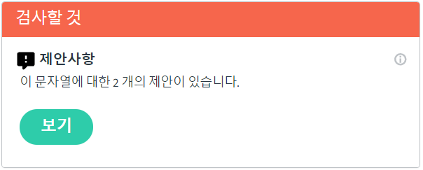

# pypi-Korean-Translations

[https://pypi.org/](https://pypi.org/) 사이트의 한국어 번역을 위한 가이드 문서입니다.

오프라인으로 번역을 진행할 수도 있지만, [warehouse](https://hosted.weblate.org/projects/pypa/warehouse/) 웹페이지를 기준으로 번역을 설명합니다.

일관된 문법 구문과 의미 전달을 유지하기 위한 몇 가지의 규칙을 정의하였습니다. 

## 1. 용어 일관성을 지켜주세요.  
Hosted Weblate의 우측 상단에 있는 용어집을 활용해주세요. (용어집이 번역이 안되어있는경우, 용어집도 번역해주시면 감사하겠습니다.)   
     
예시)  
`user`는 `사용자`로 번역되었습니다.  
└─ `username`: `사용자이름`  
`password`는 `비밀번호`로 번역되었습니다.

   
## 2. 제안사항을 처리해주세요.  
   번역하는 문장에 대해 제안사항이 있는경우에는 제안사항을 처리(수락,거절)해주세요.

## 3. 번역할지 말지 모르겠는 단어는 위키피디아(위키백과)를 참고해주세요.
ex) `WebAuthn` 용어에 대한 번역여부. 별다른 한국어 표현이 없으므로 영어 그대로 표기하였습니다.

## 4. `Korean`스럽지 않은 문장이 있다면 크게 아래 세가지 프로세스를 따라주세요.
1. 다른언어로는 어떤 문장으로 번역되었는지 참고합니다.  

2. 원본 문자열 위치 페이지에서 어떤상황에서 쓰이는 문장인지 확인하여 반역합니다.  

3. 그래도 번역하기 애매한 문장은 이슈를 남겨 토론해봅시다.
   
## 5. 번역하기 힘든 문장이 있다면 [issues](https://github.com/cpprhtn/pypi-Korean-Translations/issues) 에 등록하여 같이 토론해봅시다.

---

## 1차 번역 모임 (오프라인)
#### 일시: 2023.12.24 ~ 12.25
#### 목표: 번역율 50% 달성
#### 참여자:
<table>
    <tr height="140px">
        <td align="center" width="130px">
            
             
            <a href="https://github.com/cpprhtn">cpprhtn</a>
        </td>
        <td align="center" width="130px">
            
             
            <a href="https://github.com/choo121600">choo121600</a>
        </td>
       <td align="center" width="130px">
            
             
            <a href="https://github.com/Coalery">Coalery</a>
        </td>
       <td align="center" width="130px">
            
             
            <a href="https://github.com/kkumtree">kkumtree</a>
        </td>
    </tr>
</table>

